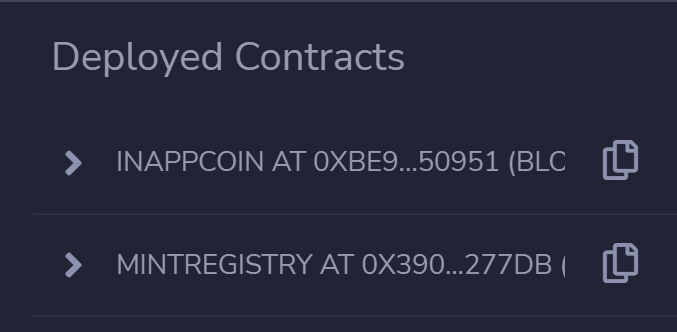
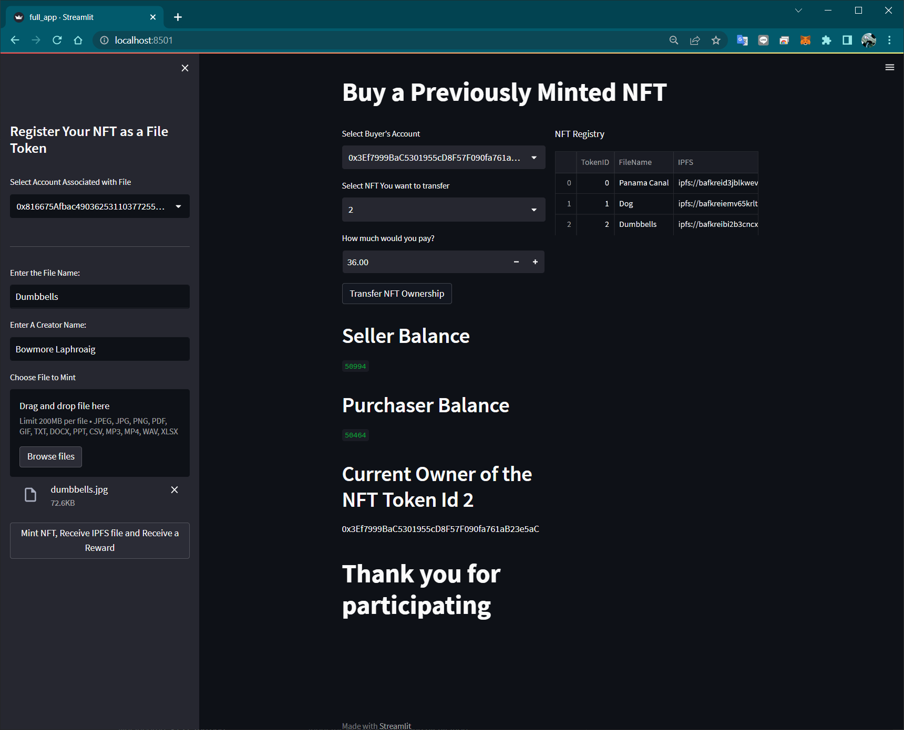

# MINT NFT Marketplace

## Table of Contents
* [Description](#description)
* [Goals](#project-goals)
* [Development and Technologies](#development-and-technologies)
* [Instructions](#instructions)
* [Outcome And Summary](#outcome-and-summary)
* [Contributors](#contributors)

## Description
---
In this project, we aim to create an NFT marketplace decentralized application (dapp) for the auction of digital assets using smart contracts, solidity and streamlit.

## Goals
---

In recent years, there has been an ever increasing interest in NFTs - As an example, one NFT which was just an image of a column written in New York Times sold for $560,000 in a matter of days. Observing such keen interest in the demand and sale of NFTs as well as the expanding market for digital assets, we felt it would be a great idea to launch our very own MINT Auction Marketplace. 

MINT's goal is to support local and emerging artists and provide them a fast and efficient FinTech platform to register their work and sell them through an auction-based marketplace allowing them to connect with collectors all over the world through a decentralized network.

Our NFT auction marketplace provides:
1. A platform that connects artists and collectors through blockchain technology with complete transparency. It holds asset/token/deed that is to be auctioned using ERC721 standards.
2. Works with digital assests stored over an established and secure file storage system (IPFS - Pinata)
3. ERC20 Token as a reward for participating in the ecosystem. This would be a benefit for upcoming projects.
4. MINT does not charge any fees or retain any of the profits from the NFT sales hence providing a free of cost platform for the artists. As opposed to OpenSea, who charge a chunky one-time registration fee to list each NFT as well as recurring fees.

## Development and Technologies
---

Our NFT marketplace is built using the following technologies: 
* Solidity (smart contracts)
* Remix IDE
* Streamlit (frontend)
* Decentralized Blockchain Network (Ganache)
* Pinata
* Python

### Libraries Used
* os
* json
* requests
* web3
* pathlib
* dotenv
* streamlit
* dataclasses
* typing
* openzeppelin (ERC721, ERC721URIStorage, Ownable, Counters)

## Instructions - Environment Preparation
---
### Files:
Download the following files to help you get started:

1. [InAppCoin.sol](./contracts/InAppCoin.sol)
2. [file_registry.sol](./contracts/file_registry.sol)

### Remix Steps:

To run the application, clone the code from this GitHub repository.

1. Compile the `InAppCoin.sol` to ensure it compiles without any errors. 
2. Compile the `file_registry.sol` to ensure it is compiled successfully.
3. Prior to deployment, ensure your Ganache Provider is connected and the corresponding wallet is selected.
4. Deploy the `InAppCoin.sol` and check the deployed contracts to ensure it is there. Copy the address to the .env file.
5. Deploy the `file_registry.sol` and check the deployed contract to ensure it is there. Copy the address to the .env file.
6. To proceed with the auction process on the registered NFT, please follow the steps demonstrated in the Auction Demo (see Videos Demos section).

### Load Keys In .env File

1. Load Ganache WEB3_PROVIDER_URI.
2. Copy STORE_OWNER_WALLET_ADDRESS from Ganache.
3. Copy deployed InAppCoin_SMART_CONTRACT_ADDRESS from InAppCoin.sol.
4. Copy deployed FILE_TOKEN_ADDRESS from file_registry.sol.
5. Load PINATA_API_KEY and PINATA_SECRET_KEY.

### Streamlit dapp

1. Open command line interface terminal
2. For MINT Marketplace dapp, navigate to location, then input command `streamlit run full_app.py`

## Outcome and Summary
---
### Running dApp

>
### IPFS/Pinata

>
### NFT Minting

>
### NFT Transferring with ICO

>
### MetaMask verification of ERC20 "MINT" Token 

>

### Optimization Opportunities: Next Steps
---
Optimization of our dApp would include the following two components:

1. Visual Tokens - Show visual/artwork with description for token for buyer rather than just token number and metadata
2. Auction - Implement auction, tracking bids over time, with transfer when transaction is approved

## Contributors
---
Project Team

Created by Yu Takahashi, Silvano Ross, Saidee Padilla and Tracie Stipp while in the UW FinTech Bootcamp
> Contact Info:
>
> email: yu.taka.070202@gmail.com |
> [GitHub](https://github.com/yutakadayo) |
> [LinkedIn](https://www.linkedin.com/in/yu-takahashi-068472235/)
>
> email: silvanoross3@gmail.com |
> [GitHub](https://github.com/silvanoross) |
> [LinkedIn](https://www.linkedin.com/in/silvano-ross-b6a15a93/)
>
> email: Rosario050597@gmail.com |
> [GitHub](https://github.com/saideepadilla) |
> [LinkedIn]()
> 
> email: stipptracie@gmail.com |
> [GitHub](https://github.com/stipptracie) |
> [LinkedIn](https://www.linkedin.com/in/tracie-stipp-0719691b/)

## References and Resources
---

[OpenZeppelin Contracts Wizard](https://docs.openzeppelin.com/contracts/4.x/wizard)  
[OpenZeppelin ERC721 Docs](https://docs.openzeppelin.com/contracts/3.x/api/token/erc721#IERC721-setApprovalForAll-address-bool-) 
